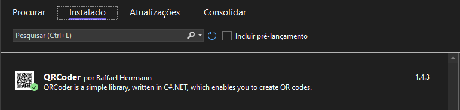
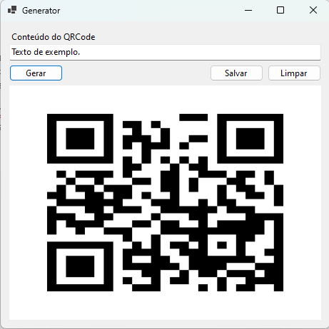

# SimpleQRCodeGenerator

Bem-vindo ao Projeto Simple QRCode Generator! 

Neste arquivo README, você encontrará informações úteis sobre o funcionamento do projeto.

## Índice

- [Sobre](#sobre)
- [Tecnologias e Frameworks](#tecnologias-e-frameworks)
- [Em funcionamento](#em-funcionamento)
- [Conclusão](#conclusão)

## Sobre

Durante minha jornada como programador acabou surgindo a necessidade de criar uma aplicação que pudesse gerar imagens de QR Codes para um sistema, para que eu pudesse testar seu funcionamento e estudar a tecnologia decidi criar um projeto simples para isso.

## Tecnologias e Frameworks 

Neste projeto, foi utilizado as seguintes tecnologias:

- C# 
- .NET 7
- Windows Forms
- QRCoder

## Em funcionamento

1. Clone este repositório: `git clone https://github.com/M-LaScala/SimpleQRCodeGenerator`
2. Navegue até o diretório do projeto e abra o arquivo .SLN com o visual studio 2022+
3. Instale os pacote NuGet dependentes

QRCoder é uma biblioteca simples, escrita em C#.NET, que permite criar QR-Codes e não possui dependências de outras bibliotecas, para seu funcionamento.

Ao executar a aplicação você irá se deparar com uma interface simples, contendo tudo o que você precisa para gerar um QR-Code a partir de uma string e salvar o mesmo em um diretório de sua escolha.
Sinta-se à vontade para experimentar a aplicação.

## Conclusão

Este projeto foi construído em um único dia, com o propósito de ser um estudo prático para a geração de QR-Codes.
O resultado final é uma aplicação simples e minimalista, que cumpre seu propósito para a geração de QR-Codes.
